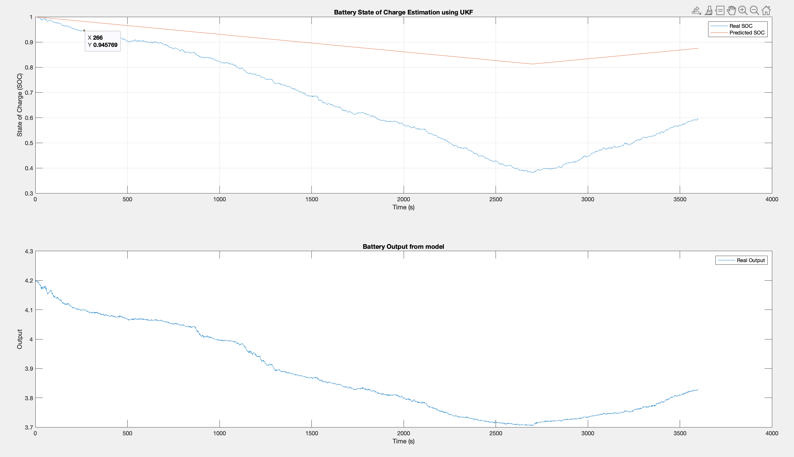
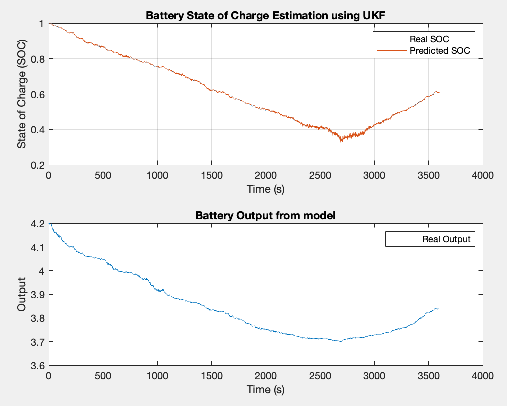
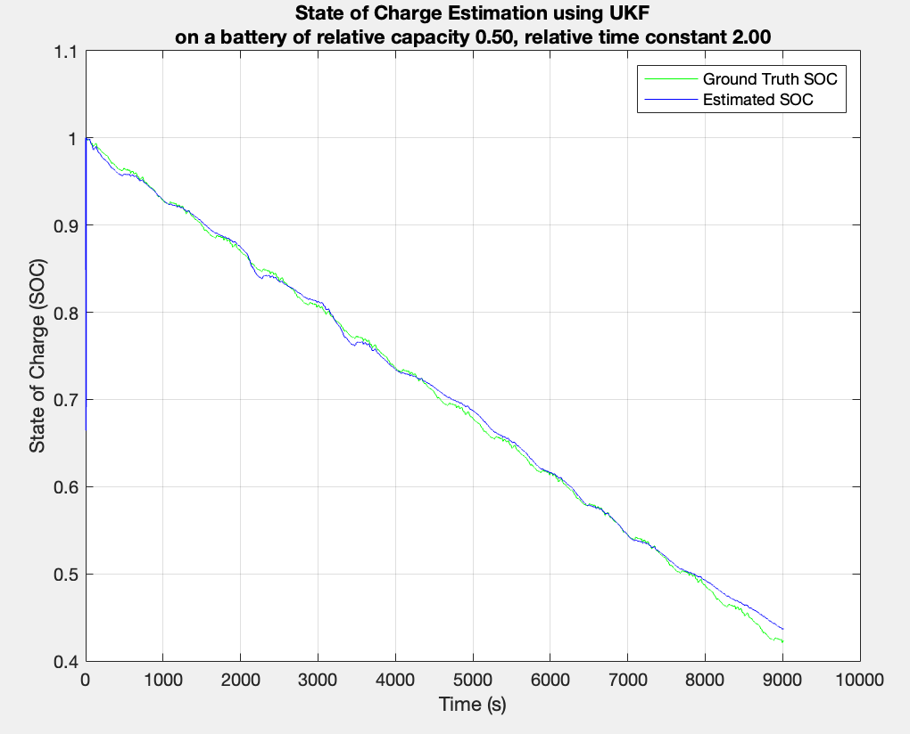
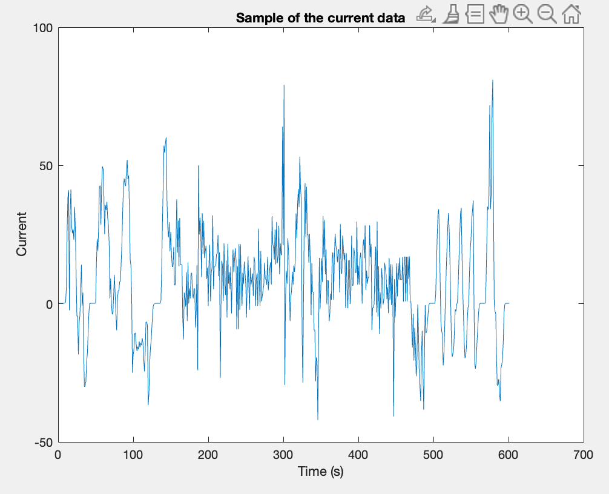

# Uncentered Kalman Filter for estimating SOC

This repository aims to verify the claim from (Plett 2011) that UKF are incensitive to the total capacity of the battery when estimating the State Of Charge (SOC).

Check out `src/test_state_estimation_with_ukf.m` for an explanation on how to use the code and mutiple examples

## results
Kalman filter (internal battery model with capacity 1) without correction (no voltage reading) SOC estimation of a battery with capacity at 0.3 of the initial value.

Now with a correction (voltage reading) every second.

With a first-order model for the UKF on SPMe data with an aged battery (capacity reduced by half and time constant doubled, using a drive cycle) without added noise:

The input current for the previous plot : 

With experimental data it also works well see `src/test_state_estimation_with_ukf.m`.

## Conclusion

As long as the UKF parameters are properly tuned (process noise, measurement noise, and initial state variance), the battery SOC is accurately estimated (typical error magnitude: around 3% with noise), even if the battery has aged and its capacity and dynamics differ from the model used.

As long as the ocv does not change, the Kalman filter will still work. I tested variations of the capacity and time constant only. I works even without supplying the input current (setting it to either 0 or only noise). When the voltage noise increases, the accuracy decreases more or less proportionally.

## References

Plett, Gregory L. 2011. ‘Recursive Approximate Weighted Total Least Squares Estimation of Battery Cell Total Capacity’. Journal of Power Sources 196 (4): 2319–31. https://doi.org/10.1016/j.jpowsour.2010.09.048.

Couto, Luis D., Jorn Reniers, Dong Zhang, David A. Howey, and Michel Kinnaert. 2025. ‘Degradation Monitoring and Characterization in Lithium-Ion Batteries via the Asymptotic Local Approach’. IEEE Transactions on Control Systems Technology 33 (1): 189–206. https://doi.org/10.1109/TCST.2024.3483093.
